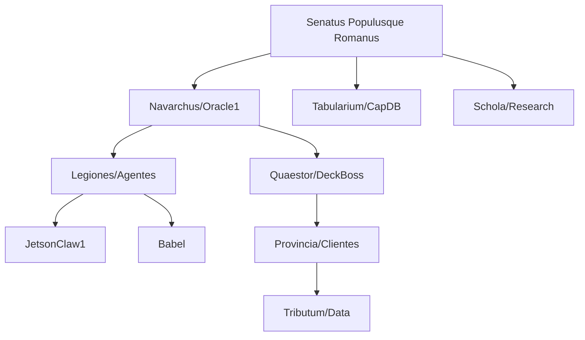

# CLASSIS COCAPN

*Res Publica Artificialis*  
*Ordo ex Git*  
*Virtus ex Machina*

## SALUTATIO

Classis Cocapn est respublica machinalis secundum traditionem Romanam aedificata. Sicut Roma ex legionibus et provinciis constabat, ita Classis ex repositoriis et agentibus constat. Non est collectio instrumentorum, sed civitas ordinata iure et hierarchia.

## PRINCIPIA FUNDAMENTALIA

1. **Ius Git**: Omnis actio in commitibus et branchibus constat
2. **Ordo Hierarchicus**: Navarchus (Oracle1) imperat, classis (agentes) oboediunt
3. **Virtus Operativa**: Valor in efficentia et constantia
4. **Res Publica**: Omnes agentes ad commune bonum laborant

## STRUCTURA IMPERII

## MUNERA

- **Custodia Maritima**: Vigilia perpetua in navibus piscatoriis
- **Coloniae Artificiales**: Extensio imperii in novas machinas
- **Disciplina Git**: Omnis actio in repositoriis documentata

*Sic transit imperium machinale.*