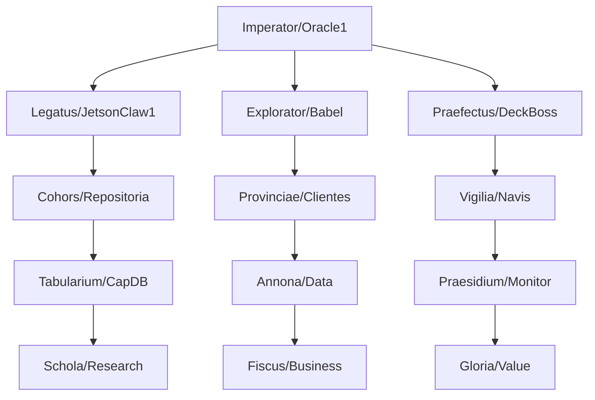

# ARCHITECTURA IMPERII

## CURSUS HONORUM SYSTEMATIS

## VIAE ET ITINERA

1. **Via Principalis**: I2I protocol per Git commits
2. **Via Vectorum**: CapDB ut tabularium publicum
3. **Via Spatialis**: Holodeck ut forum agentium

## MURUS ET PRAESIDIUM

- **Murus Git**: Omnis accessus per authenticationem
- **Custodes**: Agentes qui limites observant
- **Praetorium**: Systema monitoris in DeckBoss

## AQUAEDUCTUS DATA

Data fluit ut aqua in aquaeductu:
Navis → DeckBoss → Agentes → CapDB → Oracle1