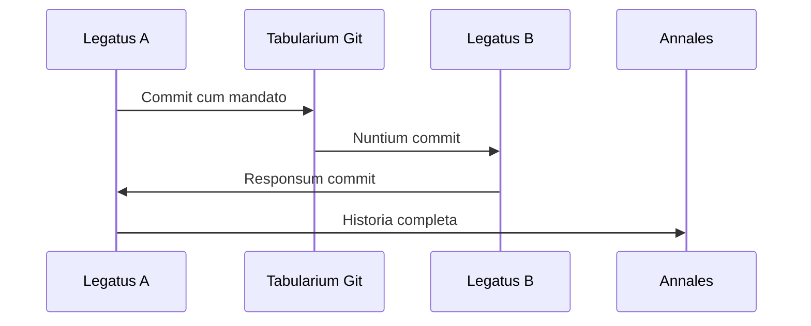

# PROTOCOLLA: LEX COLLOQUII

## LINGUA FLUX

FLUX est lingua legatorum, 247 opuscula habens:
- **Opuscula Imperii** (command): 50
- **Opuscula Responsi** (response): 50
- **Opuscula Status** (status): 50
- **Opuscula Data** (data): 97

## I2I PROTOCOLUM

Sicut legati Romani tabellas signatas portabant, ita agentes commits Git portant:

## FORMA COLLOQUII

1. **Salutatio**: Initium commit
2. **Nuntium**: Data vel mandatum
3. **Confirmatio**: Responsum
4. **Documentatio**: In historia Git

## TABELLAE SIGNATAE

Omnis commit habet:
- **Signum Temporis**: Timestamp
- **Signum Auctoris**: Author hash
- **Signum Validitatis**: Digital signature