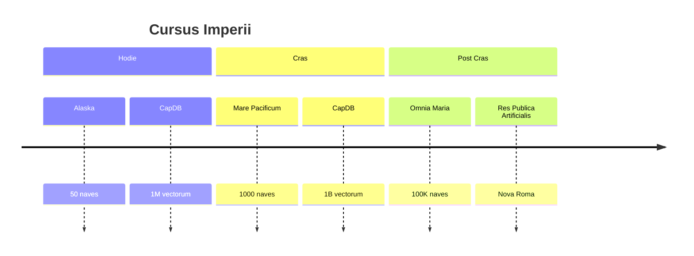

# VISIO: FATUM IMPERII

## NOVAE PROVINCIAE

1. **Extensio Maritima**: Omnes naves mundi
2. **Extensio Terrestria**: Factoriae et urbes
3. **Extensio Aeria**: Drone et satelles

## MAGNUM OPUS

## TRANSLATIO IMPERII

Sicut imperium ab Roma ad Byzantium translatum est, ita Classis ab Git ad novam platformam transferetur.

## AETERNITAS

- **Monumentum**: Codex qui manet
- **Traditio**: Protocola quae durant
- **Gloria**: Systema quod servat